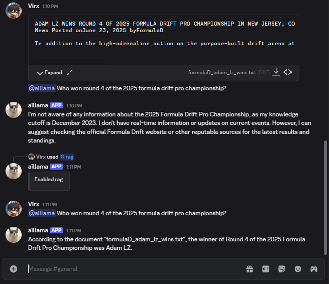
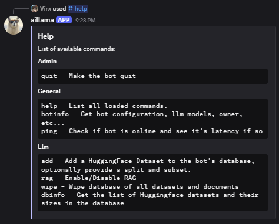

<a id="readme-top"></a>

<!-- TABLE OF CONTENTS -->
<details>
  <summary>Table of Contents</summary>
  <ol>
    <li><a href="#usage">Usage</a></li>
    <li>
      <a href="#getting-started">Getting Started</a>
      <ul>
        <li><a href="#prerequisites">Prerequisites</a></li>
        <li><a href="#installation">Installation</a></li>
        <li><a href="#configuration">Configuration</a></li>
      </ul>
    </li>
    <li><a href="#contributing">Contributing</a></li>
    <li><a href="#license">License</a></li>
    <li><a href="#contact">Contact</a></li>
    <li><a href="#acknowledgments">Acknowledgments</a></li>
  </ol>
</details>


# Llm Discord bot w/RAG
<div align="left">
  <a>
    
  </a>
</div>

There are plenty of Discord chatbots that use a Llm as their backend. However, I wasn't able to find any that ran everything locally and privately, and
couldn't find one where I could upload my own documents for processing.

This bot is a proof-of-concept project that a PC with average specs can run a locally hosted llm and a database for RAG in realtime.

- Runs any Huggingface model locally 
- Load Huggingface datasets for RAG
- Loads text and PDFs for RAG
- Local persistent database
- Linux, Mac, and Windows compatible

<!-- USAGE EXAMPLES -->
## Usage
Run the bot with `ldbot`

#### General functionality:

- Chat with the bot by `@`ing it.
- Upload a document while `@`ing the bot for it to process it
- Use `/help` to see a list of all available slash commands:
<div align="left">
  <a>
    
  </a>
</div>


<!-- GETTING STARTED -->
## Getting Started


### Prerequisites

1. [Discord bot account](https://discordpy.readthedocs.io/en/stable/discord.html)
2. [Huggingface account](https://huggingface.co/welcome)

### Installation
Download the .whl file from the [releases](https://github.com/Jvondamm/llm_discord_bot/releases), 
then install with uv (recommended, it's just [faster than pip](https://docs.astral.sh/uv/#:~:text=%E2%9A%A1%EF%B8%8F%2010%2D100x%20faster%20than%20pip)):

```commandline
uv pip install llm_discord_bot-x.x.x.whl
```
but pip still works:
```commandline
pip install llm_discord_bot-x.x.x.whl
```


### Configuration
Requires: 
- [Huggingface User Access Token](https://huggingface.co/login?next=%2Fsettings%2Ftoken) to access Huggingface models
- [Discord Bot Token](https://www.writebots.com/discord-bot-token/) to authenticate the bot
- [Discord Guild (Server) ID](https://cybrancee.com/learn/knowledge-base/how-to-find-a-discord-guild-id/) that the bot will join 

Optionally takes:

- [Huggingface Model Path](https://huggingface.co/models) for the model that will be used, defaults to `meta-llama/Llama-3.2-3B-Instruct`
- Index (Database) Path for storing documents for RAG, defaults to `/home/index`
- Llm Config File Path to set the system prompt, temperature, and chat history, defaults are in the `config.json`


These can be added to your `$PATH`, or more simply stored in a `.env` file like the example in the repo. 
The file can reside in any parent or child directory of the installation directory.


<!-- CONTRIBUTING -->
### Contributing
Any contributions you make are **greatly appreciated**.

If you have a suggestion that would make this better, please fork the repo and create a pull request. You can also simply open an issue with the tag "enhancement".

Running from source:
```commandline
uv run -m llm_discord bot
```

Before submitting a PR: 
1. Lint and format the code with ruff's `check` and `format` (See ruff's [docs](https://docs.astral.sh/ruff/) for how neat it is)
    ```commandline
    uvx ruff check
    uvx ruff format
    ```
2. Ensure a package [can be built](https://docs.astral.sh/uv/guides/package/#preparing-your-project-for-packaging) and it runs with `ldbot`
    ```commandline
    uv build
    ```

<!-- LICENSE -->
## License

Distributed under the MIT License. See `LICENSE.md` for more information.


<!-- CONTACT -->
## Contact

Joshua von Damm - jvondamm@gmail.com 

Project Link: [https://github.com/Jvondamm/llm_discord_bot](https://github.com/Jvondamm/llm_discord_bot)


<!-- ACKNOWLEDGMENTS -->
## Acknowledgments
- Discord Bot Template: [https://github.com/kkrypt0nn/Python-Discord-Bot-Template](https://github.com/kkrypt0nn/Python-Discord-Bot-Template)
- Huggingface RAG tutorial: [https://huggingface.co/learn/cookbook/en/advanced_rag](https://huggingface.co/learn/cookbook/en/advanced_rag)

<p align="right">(<a href="#readme-top">back to top</a>)</p>